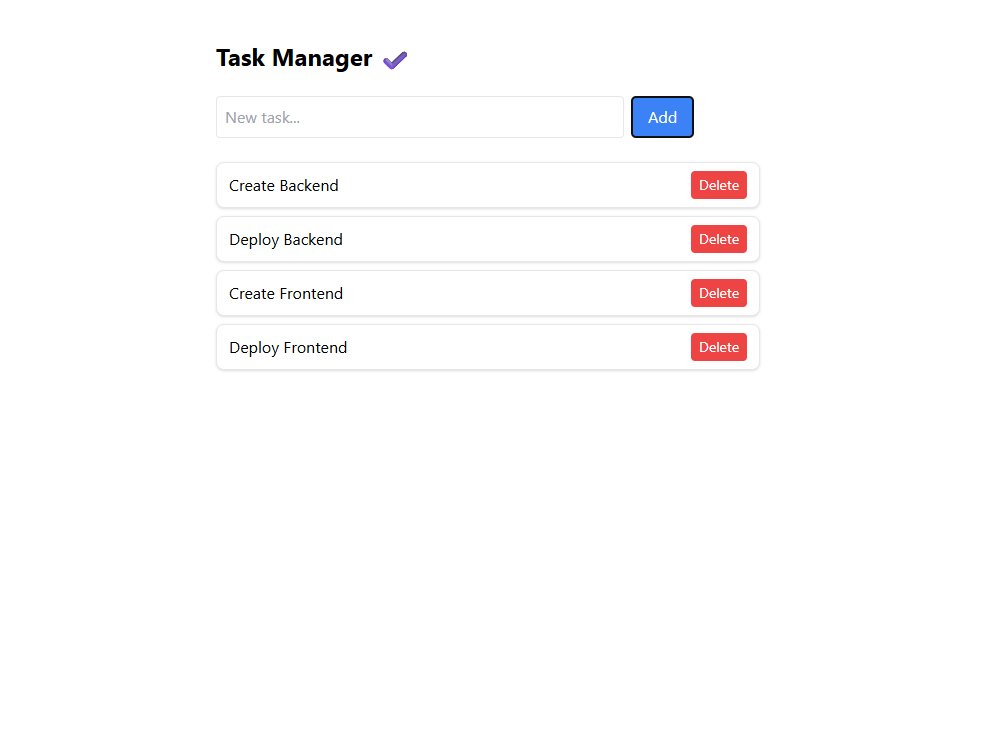
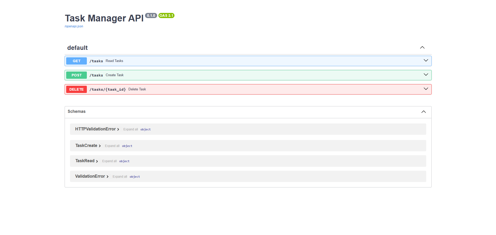

# ✅ Task Manager App

[](https://github.com/JinsJK/task-api/actions/workflows/ci.yml)
[](https://github.com/JinsJK/task-api/actions/workflows/backend-deploy.yml)
[](https://github.com/JinsJK/task-api/actions/workflows/frontend-deploy.yml)


A full-stack Task Manager application built with **Vue 3 (Vite + Tailwind CSS)** and **FastAPI** (async + PostgreSQL), showcasing clean architecture, modern tooling, CI/CD, containerization, and deployment using **Fly.io**.

---

## 🔗 Live Demo

- **Frontend:** [https://frontend-lively-hill-6164.fly.dev](https://frontend-lively-hill-6164.fly.dev)
- **Backend API:** [https://task-api-frosty-sea-8995.fly.dev/docs](https://task-api-frosty-sea-8995.fly.dev/docs)

---

## 📸 Screenshots

### Task Manager UI


### Swagger API Docs


---

## ⚙️ Features

- ✅ Add, view, and delete tasks
- 🚀 FastAPI async backend with PostgreSQL
- 🎨 Vue 3 + Tailwind CSS frontend
- 🧪 Pytest with SQLite in-memory testing
- 🐳 Docker & Docker Compose support
- ☁️ Fly.io deployment (frontend and backend)
- 🔁 GitHub Actions for CI/CD
- 🌐 CORS configured for full-stack interaction

---

## 🛠 Tech Stack

| Layer     | Tech Stack                                      |
|-----------|--------------------------------------------------|
| Frontend  | Vue 3, Vite, Tailwind CSS, Axios, Vue3 Toastify  |
| Backend   | FastAPI, SQLAlchemy (async), PostgreSQL          |
| Database  | PostgreSQL (via Docker)                          |
| Testing   | Pytest, pytest-asyncio, HTTPX, SQLite            |
| CI/CD     | GitHub Actions                                   |
| Deploy    | Fly.io                                           |
| DevOps    | Docker, Docker Compose, Nginx                    |
| Linting   | Ruff                                             |

---

## 📁 Project Structure

```
.
├── .github/
│   └── workflows/
│       ├── ci.yml
│       ├── fly-deploy.yml
│       └── frontend-deploy.yml
├── backend/
│   ├── __init__.py
│   ├── database.py
│   ├── main.py
│   ├── models.py
│   ├── routes.py
│   ├── schemas.py
│   └── test_database.py
├── frontend/
│   ├── .vscode/
│   ├── dist/
│   ├── node_modules/
│   ├── public/
│   ├── src/
│   │   ├── components/
│   │   │   ├── TaskForm.vue
│   │   │   └── TaskList.vue
│   │   ├── api.js
│   │   ├── App.vue
│   │   ├── index.css
│   │   └── main.js
│   ├── .dockerignore
│   ├── .gitignore
│   ├── Dockerfile
│   ├── fly.toml
│   ├── index.html
│   ├── nginx.conf
│   ├── package.json
│   ├── package-lock.json
│   ├── postcss.config.js
│   ├── static.json
│   ├── tailwind.config.js
│   └── vite.config.js
├── screenshots/
│   ├── frontend.png
│   └── swagger.png
├── tests/
│   ├── __pycache__/
│   └── test_main.py
├── venv/
├── .dockerignore
├── .env
├── .gitignore
├── docker-compose.yml
├── Dockerfile
├── fly.toml
├── pytest.ini
├── requirements.txt
└── README.md
```


---

## 🚀 Local Development

### 📦 Backend Setup

```bash
cd backend
python3 -m venv venv
source venv/bin/activate
pip install -r requirements.txt
uvicorn main:app --reload
```

Visit: [http://localhost:8000/docs](http://localhost:8000/docs)

### 🖼 Frontend Setup

```bash
cd frontend
npm install
npm run dev
```

Visit: [http://localhost:3000](http://localhost:3000)

---

## 🐳 Docker Setup

```bash
docker-compose up --build
```

- Backend: http://localhost:8000
- Frontend (via Nginx): http://localhost:3000
- PostgreSQL: exposed internally to backend

---

## 🔁 CI/CD Workflow (GitHub Actions)

This project uses **GitHub Actions** to automate testing, linting, and deployment to **Fly.io**.

### 📂 Workflow Files

| File                          | Description                                                                 |
|-------------------------------|-----------------------------------------------------------------------------|
| `.github/workflows/ci.yml`            | Runs lint checks with `ruff`, unit tests with `pytest`, and generates test coverage reports on every push or PR to `main`. |
| `.github/workflows/fly-deploy.yml`    | Automatically deploys the **backend** to Fly.io when changes are pushed to the `main` branch. |
| `.github/workflows/frontend-deploy.yml` | Deploys the **frontend** app to Fly.io when frontend files are updated and pushed. |

### 🧪 CI Pipeline Steps

- ✅ Lint Python code with `ruff`
- 🧪 Run all unit/integration tests with `pytest` + `pytest-asyncio`
- 📊 Generate code coverage using `pytest-cov`
- 🚀 Deploy to Fly.io if push is on `main` branch (for frontend and backend)

> These workflows help enforce code quality and automate deployment with zero downtime.

---

## ☁️ Fly.io Deployment

You can deploy the frontend and backend independently using Fly.io.

### 🔧 Backend: `fly deploy` from `backend/` with `fly.toml`

```toml
app = "task-api-frosty-sea-8995"

[http_service]
  internal_port = 8080
  force_https = true
  auto_start_machines = true
  auto_stop_machines = true
  min_machines_running = 0
```

Deploy:

```bash
cd backend
fly deploy
```

---

### 🎨 Frontend: `fly deploy` from `frontend/` with `fly.toml`

```toml
app = "frontend-lively-hill-6164"

[http_service]
  internal_port = 80
  force_https = true
  auto_start_machines = true
  auto_stop_machines = true
  min_machines_running = 0
```

Deploy:

```bash
cd frontend
fly deploy
```

---

## 🧪 Testing

```bash
cd backend
pytest --cov=.
```

- In-memory SQLite test DB (`aiosqlite`)
- FastAPI test client (HTTPX)
- Covers CRUD routes with async DB session override

---

## 🔌 API Endpoints

| Method | Endpoint         | Description        |
|--------|------------------|--------------------|
| GET    | `/tasks`         | List all tasks     |
| POST   | `/tasks`         | Create new task    |
| DELETE | `/tasks/{id}`    | Delete task by ID  |

Explore with Swagger: `/docs`

## ✍️ Author

**Jins Joseph Kakkanattu**  
🎓 Master’s Student in Applied Computer Science, Germany  
💼 Full-Stack Developer | Python & DevOps Enthusiast  
🌐 [LinkedIn](https://linkedin.com/in/jins-j-k-4345841b5)  
📧 jins7152@gmail.com 

---

## 🤝 Contributing

Pull requests are welcome. For major changes, please open an issue first to discuss what you would like to change.
